# CMPS-413-001-Semester-Project-ClassChat-C00460817
Repository for the work done on the Semester Project in CMPS-413-001.

## Project Description
The objective of this project is to design and develop an online chat system, named ClassChat, 
to be used for communications and discussions among students in a class. The ClassChat is to 
offer a software platform including the function of enabling students to chat with Instructor and 
other students for any necessary discussions, i.e., homework problems. We give guidelines for 
the system design of ClassChat. This is done via a TCP client-server connection that allows for broadcasting messages to all clients, or private messaging between specific clients.

## How to Access This Repository and ClassChat Application
Here are some instructions on how to use this repo and operate the ClassChat System:

### Setting up the ClassChat Application
1. Clone the repository to your local machine using the command: `git clone https://github.com/rgautreaux/CMPS-413-001-Semester-Project-ClassChat-C00460817.git`
2. Navigate to the project directory: `cd CMPS-413-001-Semester-Project-ClassChat-C00460817`
3. Make sure you have ``Python 3.14.3`` installed on your computer, as ClassChat was developed through Python. You can download Python from https://www.python.org/downloads/ if you don't have it already.
4. Make sure you have the necessary libraries installed. You can install them using pip:
   - For the server and command-line client: `pip install socket threading json`
   - For the GUI client: `pip install socket threading json tkinter`
   - Note: The `tkinter` library is usually included with Python, but if you encounter issues, you may need to install it separately based on your operating system.
  

### Starting Up the ClassChat Application
1. Start the server by running the `ClassChatServer.py` script: 
   - This is done by opening a terminal or command prompt and running `python ClassChatServer.py`
2. Start one or more clients by running either the `ClassChatClient.py` (for command-line interface) or `ClassChatClient-GUI.py` (for graphical user interface) script:
   - For command-line client: Open a new terminal and run `python ClassChatClient.py`
   - For GUI client: Open a new terminal and run `python ClassChatClient-GUI.py`
3. Follow the prompts in the client application to connect to the server, enter your username, and start chatting with other connected clients!

## How to Use the ClassChat Application
- Once connected, after providing your username, you can start sending messages! The message types available are: Broadcast, Private, Group Commands/Messages, Offline Messages, and Encrypted Messages. Here’s how to use each type of message:

### Broadcasting and Private Messaging
- **Broadcast Message**
  - To send a message to all connected clients for *Command Line*:
      1.  Select "broadcast" as your message type.
      2.  Enter "all" as the recipient if prompted for one.
      3.  Enter your message in the message field when prompted and send it. 
      4.  This will broadcast the message to everyone connected to the server.
  - To send a broadcast message using the *GUI*:
      1.  Enter your message in the message field and press "Send". 
      2.  This will broadcast the message to everyone connected to the server.

- **Private Message**
  - To send a private message to a specific user for *Command Line*:
        1.  Select "private" as your message type.
        2.  When prompted for the recipient, enter the username of the client you want to message (e.g., "username").
        3.  Enter your message in the message field when prompted and send it. 
        4.  This will send the message only to the specified recipient if they are connected to the server.
  - To send a private message using the *GUI*:
        1.  Enter your message in the message field and press the "private" button for the message type.
        2.  In the recipient field, enter the username of the client you want to message (e.g., "username") and press "OK".
        3.  This will send the message only to the specified recipient if they are connected to the server.

### Group Commands and Messages
- **Group Commands and Messages**
  - **Command Line**:
      - To send a group command for *Command Line*:
        1.  Select "group" as your message type.
        2.  When asked to administer a command or message, select "command".
            -  If you wish to create a group, select "create" for your command type and follow the prompts to name the group.
            -  If you wish to join a group, select "join" for your command type and follow the prompts to enter the name of the group you wish to join.
            -  If you wish to see all the groups available to join, select "list" for your command type and it will list all available groups.
            -  If you wish to leave a group, select "leave" for your command type and follow the prompts to enter the name of the group you wish to leave.
     -  To send a group command message using *Command Line*:
        1.  Select "group" as your message type.
        2.  When asked to administer a command or message, select "message".
        3.  When prompted for the group name, enter the name of the group you want to message (e.g., "groupname").
        4.  Enter your message in the message field when prompted and send it. 
        5.  This will send the message to all members of the specified group if you are a member of that group.
  - **GUI**:
      - To send a group command message using the *GUI*:
        1.  Enter your message in the message field and press the "group command" button for the message type.
        2.  When asked to administer a command or message, select "command".
            -  If you wish to create a group, enter "create" in the field for your command type and follow the prompts to name the group.
            -  If you wish to join a group, enter "join" in the field for your command type and follow the prompts to enter the name of the group you wish to join.
            -  If you wish to see all the groups available to join, enter "list" into the field for your command type and it will list all available groups.
            -  If you wish to leave a group, enter "leave" into the field for your command type and follow the prompts to enter the name of the group you wish to leave.
      - To send a group message using the *GUI*:
        1.  Enter your message in the message field and press the "group message" button for the message type.
        2.  When prompted for the group name, enter the name of the group you want to message (e.g., "groupname") and press "OK".
        3.  This will send the message to all members of the specified group if you are a member of that group.  

### Special Message Types (Offline and Encrypted)
- **Offline Messages**
  - To send a message to an offline user for *Command Line*:
        1.  Select "offline_message" as your message type.
        2.  When prompted for the recipient, enter the username of the client you want to message (e.g., "username").
        3.  Enter your message in the message field when prompted and send it. 
        4.  This will store the message on the server and deliver it to the specified recipient when they next connect to the server.
  - To send a message to an offline user using the *GUI*:
        1.  Enter your message in the message field and press the "offline message" button for the message type.
        2.  In the recipient field, enter the username of the client you want to message (e.g., "username") and press "OK".
        3.  This will store the message on the server and deliver it to the specified recipient when they next connect to the server. 
- **Encrypted Messages**
  - To send an encrypted message for *Command Line*:
        1.  Select "encrypted" as your message type.
        2.  Enter your message in the message field when prompted and send it. 
        3.  This will encrypt the message using a simple Caesar cipher before sending broadcasting it to all users connected to the server.
    - To send an encrypted message using the *GUI*:
        1.  Enter your message in the message field and press the "encrypted" button for the message type.
        2.  This will encrypt the message using a simple Caesar cipher before broadcasting it to all users connected to the server.

### How to Exit the ClassChat Application
- To exit the **ClassChat** application:
  - **Client-Side**:
    - For the *Command Line Client*, simply type "exit" as your message type and send it. This will disconnect you from the server and close the client application.
    - For the *GUI Client*, simply press the "Disconnect" button. This will disconnect you from the server and close the client application window.
  - **Server-Side**:
    - To stop the *Server*, you can simply close the terminal or command prompt where the server is running. This will shut down the server and disconnect all connected clients.

### Visual Aids for Using the ClassChat Application
Here are some screenshots from the final testing phase of the ClassChat application, demonstrating how to use the various features and what the interfaces look like:

#### Command Line Client:
All Command Line Screenshots, showing a demonstration of all functions from teh perspective of three clients:
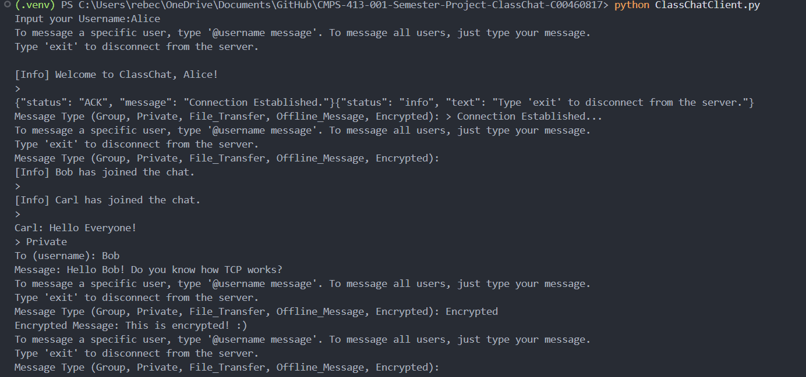
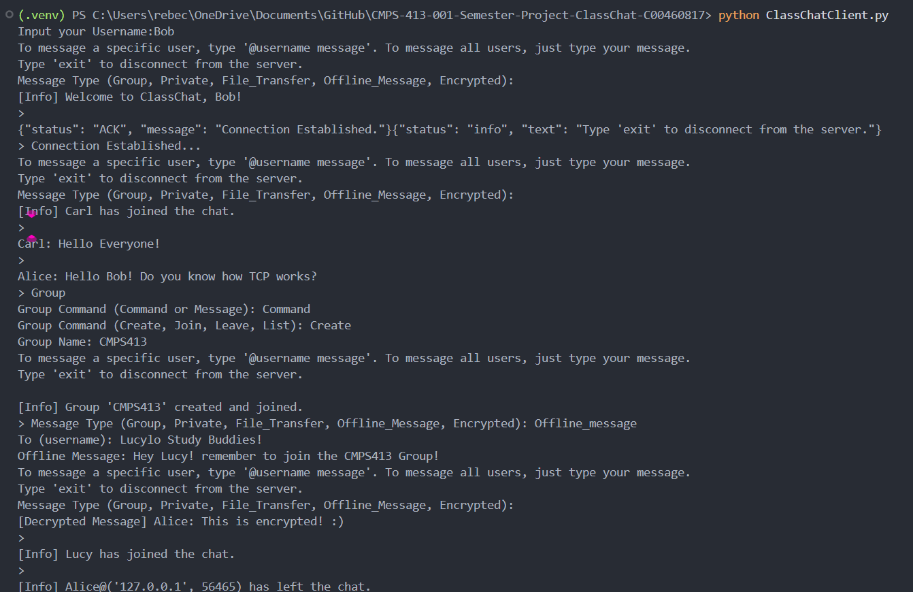
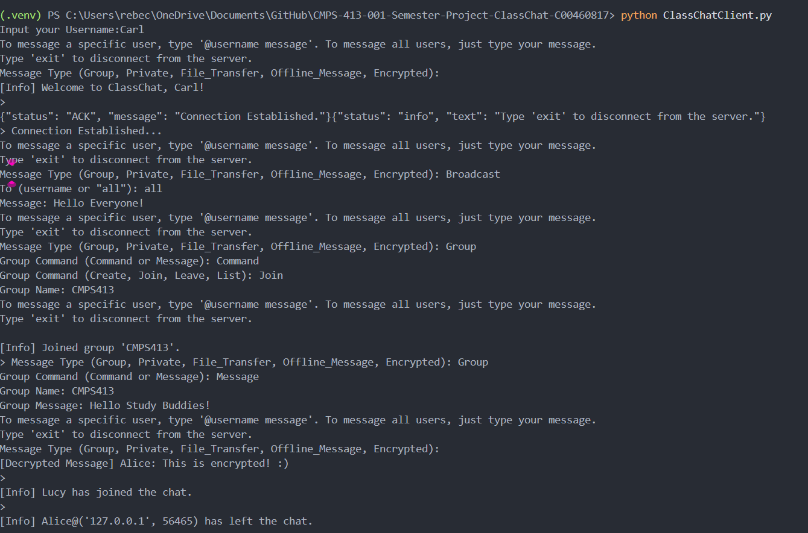
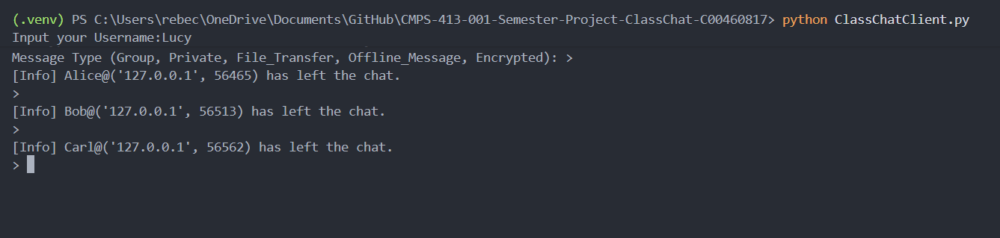

### GUI Client:
#### Broadcasting and Private Messaging

 

#### Group Commands and Messages
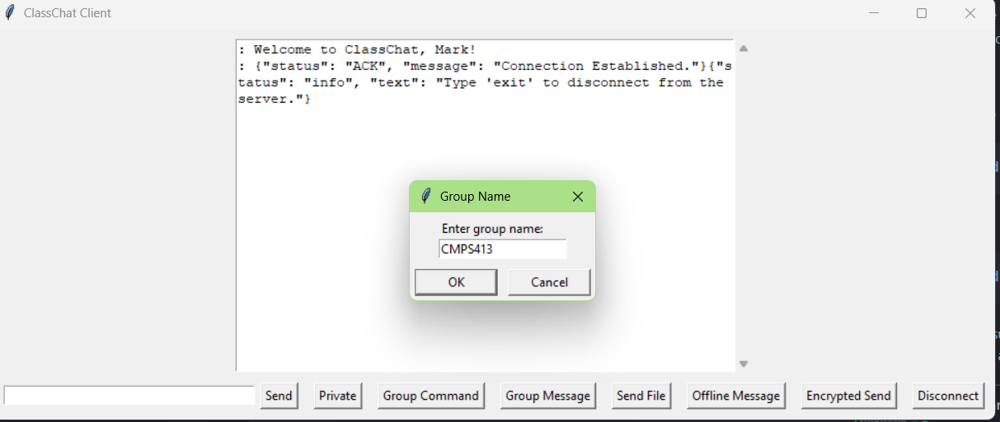
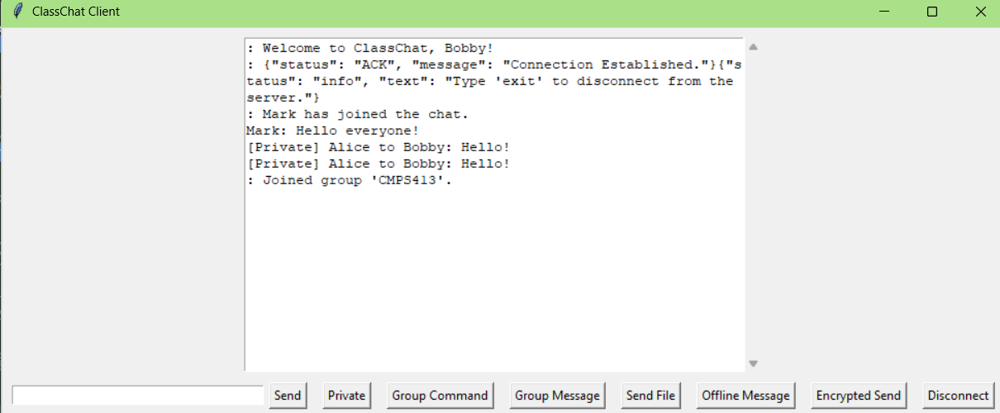

#### Special Message Types (Offline and Encrypted)
##### Offline
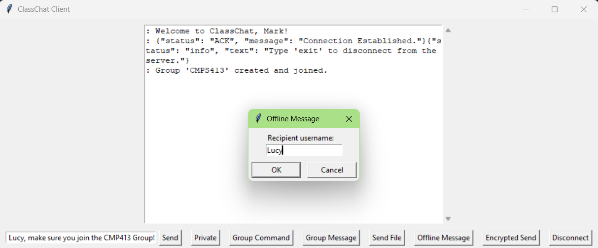
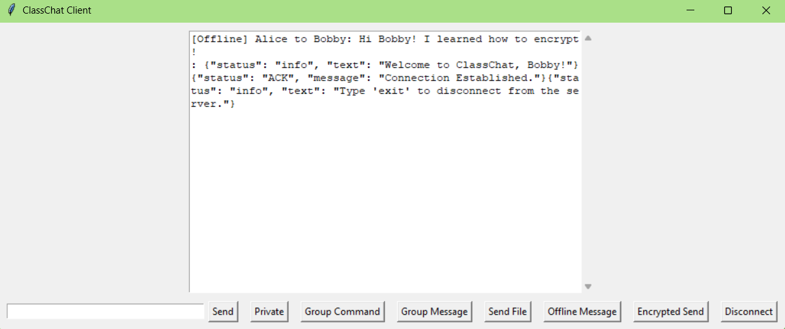

##### Encrypted

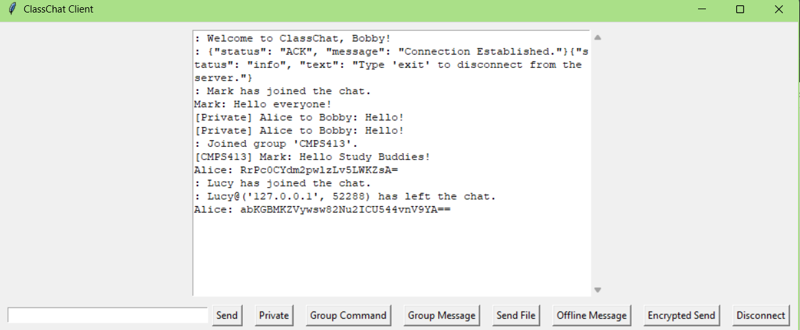

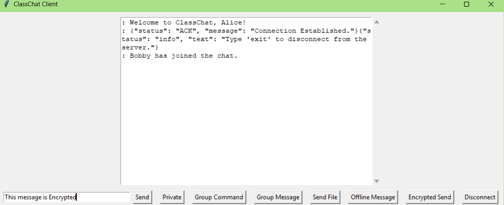
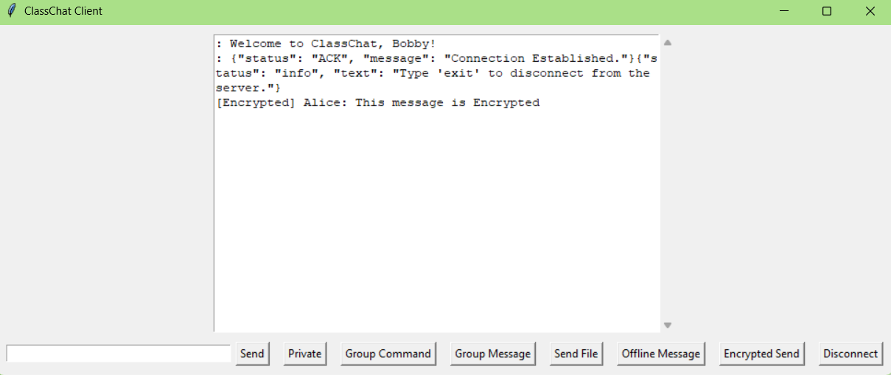

## Project Structure
The project is structured as follows:
- `ClassChatServer.py`:  This is the Server-side of this TCP Client-Server Connection.  It listens for incoming client connections, manages all connected clients, and allows the aforementioned messaging functions.
- `ClassChatClient.py`: This is the Command Line Version of the Client-side of this TCP Client-Server Connection. It connects to the server, allows the user to send messages, and displays incoming messages from the server (broadcasted and private if addressed to this user).
- `ClassChatClient-GUI.py`: This is the Graphical User Interface (GUI) Version of the Client-side of this TCP Client-Server Connection. It provides a more user-friendly interface for connecting to the server, sending messages, and displaying incoming messages (the same functionality as the command-line version, but a different interface/format).
- `README.md`: This file, providing an overview of the project, its structure, its functionality, and a guide for using this ClassChat Application System.
- `TECHNICAL-REPORT.md`: This file contains a detailed technical report of the project, including design decisions, implementation details, challenges faced, and how they were overcome. It documents the development process, what steps were taken, and the usage of AI Tools to assist in the project development.
- `TRANSCRIPT.md`: This file contains a transcript of the interactions and communications with AI Tools that took place during the development of the project, including step planning, explanations for new libraries/languages, code reviews, and any relevant conversations that contributed to the project's progress.
- `ClassChatDemoSCript.json` and `MessageFormat.json`: These files contain example scripts and message formats used in the ClassChat application, demonstrating how the messages are parsed and structured in a JSON format for server-client communication.
- `Networking Semester Project Instructions.pdf`: This file contains the original instructions and requirements for the semester project, outlining the objectives, deliverables, and guidelines for the development of the ClassChat application.
- `testing-file.txt`: A text file to use for testing the File Transfer Feature. This feature was unable to be fully implemented due to time constraints and difficulty in correcting errors, but the file is included for demonstration purposes and future development.

# Acknowledgements/Credits

This project was developed by Rebecca Gautreaux for the CMPS-413-001 Semester Project. The development of this project was assisted by AI tools, which were used for code review, debugging, planning implementation, and providing explanations for new libraries and concepts. The use of AI tools helped to resolve errors, repair broken code, and explain/bread-down how to tackle unclear or complex challenges.