# Semester Project Technical Report
## Introduction
The objective of this project is to design and develop an online chat system, named ClassChat, 
to be used for communications and discussions among students in a class. This Technical Report provides an overview of the design and implementation of the ClassChat system, including the architecture, technologies used, and challenges faced during development.

---

## 1 Client–Server Communication using TCP/IP (30 points)

This section will describe the process of implementing the first step of this semester project: creating a client-server communication using TCP/IP. The server is intended to listen for incoming connections from clients, and clients will connect to the server to send and receive messages.

### 1.1 Server Implementation

Using the examples found in the textbook as a guide, I proceeded to create the `ClassChatClient.py` and `ClassChatServer.py` files for the server and client respectively. When inputting the code samples from the textbook chapter slides, the VSCode editor automatically identified syntax errors due to mismatched quotes, and I made the proper adjustments.  I also changed the basic server name into "ClassChatServer" to make it more specific to this project.

### 1.2 Client Implementation

When starting this step, I realized I had accidentally put the Client code into the Server file, and fixed this mistake. I then followed the same process for the client implementation, using the example in the textbook slides as a guide, and referring to it when writing the file contents.  Once both the Server and Client files were created, VSCode identified syntax errors in the code, specifically a Wildcard import error due to the `from socket import *` line from the textbook slide example at the top of both files. 

The VSCode error flag provided the following link, which broke down the error and how to resolve it:
https://github.com/microsoft/pylance-release/blob/main/docs/diagnostics/reportWildcardImportFromLibrary.md

I used this guidance to change the import statement to `from socket import socket, AF_INET, SOCK_STREAM`, based on the `(server/client)Socket = socket(AF_INET,SOCK_STREAM)` calls later on in these files. This change resolved the syntax error and allowed me to proceed with the implementation of the client-server communication.

### 1.3 Requirements  

The Client-Server pair are now created, with no remaining errors recognized by the VSCode editor. I adjusted the names of some variables to specifically fit the project, and not the template/example that I based the code on.Before proceeding into the next step of this project and implementing the Advanced Client requirements, I ran the server and client files to verify that their basic TCP/IP communication worked. 

The Server launched and listened for clients as designed, but an error occurred when the Client attempted to connect.  I was unsure of the cause for this error, and asked Github Copilot for assistance in diagnosing the source of the issue. It stated that the reason for this problem was due to the `servername` variable not being a valid hostname or address, recommending I change it to `localhost`.  In hindsight, this was a very simple mistake that I should have caught myself, but I had been so focused on following the textbook example and getting the code to run that I overlooked this detail.

I did this and tried running the server and client again, and this time it worked. I was able to enter a username and receive a response from the server, confirming that the TCP/IP communication was successfully established between the client and server.

I thus added an entry to the `TRANSCRIPT.md` file to document the exact usage of Github Copilot to help identify this issue and find its resolution for full transparency.

---

## 2 Advanced Client (20 points)

Now that the simple client-server communication system has been created and verified, it was time to move onto the next step of Advancing Client capabilities so that a client can both send and receive message at the 
same time with less CPU workload. I/O multiplexing was the suggested method of executing this task within the instructions, specifically to use system callback function to activate a client’s application if the socket receives data from the server or keyboard input from the user. 

Thus, I went back to the textbook chapter slides to review Multiplexing and how it worked. These slides defined Multiplexing as a method to handle data from multiple sockets, and Demultiplexing as using header info to deliver these received segments to correct socket.

The instructions also provided a list of the proper calls for multiplexing:  `select()`, `poll()` and `epoll()` in the Client. The textbook slides did not provide any examples of how to implement these calls, so I turned to Github Copilot for assistance in understanding what these functions were, how they were typically used, and which would be best depending on the desired scalability. 

I decided to use the recommended `select()` function, as it provided maximum portability and simplicity. I then added `import select` to the top of the `ClassChatClient.py` file, and proceeded to begin writing the `select()` function call into the Client based on a provided example.  As I was doing so, the VSCode editor identified syntax errors in the code, and automatically auto-filled the command to resolve it.

To make sure I was using the `select()` function correctly, I again turned to Github Copilot for assistance in verifying that I properly implemented this function within the context of the Client-Server communication. Copilot then identified two major issues with my code:

1. The code only used `select()` to wait for the server response after sending the username and not monitor continuously monitor both the socket (for incoming server messages) and standard input (for user input) in a loop.

2. The client was not able to send messages (from user input) and receive messages (from the server) at any time, without blocking.

From here it gave an example on how to properly implement the `select()` function for Windows, which I then used as a guide to adjust my implementation and fix these problems. From there I asked it one last time to be sure I had implemented the `select()` function correctly, and it confirmed that I had done so properly, with a minor adjustment suggestion on how to avoid double prompting.

From here, I ran the server and client to verify that the Client-Server communication would still work with these new changes, and that this Multiplexing method was working correctly as well. The below errors occured:

I then asked Github Copilot for assistance in diagnosing the source of these errors, and it identified that the issue was due to the fact that the `select()` function on Windows does not support monitoring standard input (keyboard input) directly. It recommended using a workaround by creating a separate thread to read user input and send it to the server, while the main thread continues to use `select()` to monitor the socket for incoming messages from the server. I used the provided example to implement this workaround. Once this change was made I reran the server and client to test:

The server and client now worked when launched, though after the first message was sent from the client to the server, the client would not receive any responses from the server. I again turned to Github Copilot for assistance in diagnosing this issue. This was fixed using Copilot's suggestion to improve the server loop by adding a check for empty messages. This resolved the issue and allowed the client to properly receive messages from the server after sending a message.

I updated the `TRANSCRIPT.md` file to document the exact usage of Github Copilot to help identify these issues and find their resolutions for full transparency.

---

## 3 Multi-Thread Communication Server 

Once the Advanced Client abilities were implemented and testing it was successful, I moved on to the next step of the project: creating a Multi-Thread Communication Server. The goal of this step was to further develop the server to handle multiple clients simultaneously to handle multiple concurrent problems. This way, ClassChat could allow multiple students to discuss class topics or homework problems at the same time. Seeing as the last step of this project revealed I could not use I/O Multiplexing, and I had to implement threading to work around this issue, this felt like the natural choice for the next step.

I asked Copilot for a general idea of how to impement a multi-threaded server, and it produced a Five Phase Plan outlining the major steps to implement this feature. My goal was to follow this plan manually, and get as close to perfect as possible using what I've learned so far, and then have Copilot review my implementation to ensure I had done so correctly.

Firstly, I created a shared `clients = []` list to track active clients and their threads, applying a `threading.Lock()` to ensure thread safety. I then tried implementing the client handling to create a new thread for each oncoming client connection.  After this, I did my best to have the threads listen for their respective clients. Then I added the broadcasting funciton with the help of VSCode's auto-fill.  Finally I tried to have the disconnected clients removed from the active clients list, and their threads properly closed.

After my first manual implementation attempt, I asked Copilot to review my code and identify any issues. It identified several problems with my implementation, including: what tasks were incomplete, what tasks were incorrect, and what tasks were missing. I then proceeded to use this analysis to adjust my implementation and fix these problems. After a second review by Copilot, I went through each issue it identified and asked it for specific guidance on how to fix each one. I then used this guidance/examples to make the necessary manual adjustments to my implementation.

Once all necessary additions/edits were made and all errors were resolved, I tested the server and created three client terminals, switching between the three to test if multiple clients could connect and communicate with one another and the server. Below are screenshots of the successful testing of this feature:

A small formatting edit was implemented to the broadcast messaging in order to clear up any confusion, as the results of this test were a little jumbled and hard to follow. With tips from GitHub Copilot's analysis, I did some syntax and formatting tweaks. Below is the newest test results:

I then updated the `TRANSCRIPT.md` file to document the exact usage of Github Copilot to help identify these issues and find their resolutions for full transparency.

---

# 4  Client-Client Communication

Now that Multi-Thread COmmunication was implemented and my test run was a success, it was time to move on to the Final Required Step of the project: Client-Client Communication.  The objective of this step, according to the instructions, was to implemetnt the following:

1. Client management. 
2.  Receive message from a sending client. 
3.  Forward message to a receiving client.
  
As Multi-Thread Communication between multiple clients was already implemented and teste, I was unsure of what specific modifications to add for this step to improve the functionality and implement direct Client-to-Client communication. I started by asking Copilot for a general idea of what needed to be added or edited to fulfill these requirements. Copilot provided a list of what specific changes were necessary (a general overview with no example code), and I used this list to guide my manual implementation of these changes. First I tried to implement username to socket mapping for clients to be able to communicate directly and improve the existing client management.  The autofill suggestions from VSCode were very helpful in this step, as it corrected syntax errors/mistakes I made like trying to use `remove()` to remove logged out client usernames rather than `pop()`.  I then attempted to edit the codebase to send/recieve/forward messages in the JSON Format discussed in the instructions, and to implement the necessary checks to ensure that messages were being sent to the correct recipients. This was a bit tricky to figure out, but I did my best to implement this on my own using the knowledge I had gained so far.

After this first implementation attempt, I asked Copilot to review my code and identify any issues. While I succeeded in having the Server recieve and parse JSONs and broadcast messages to all clients, the direct messaging features and proper formatting for client prompts and server sending were not properly implemented. I then used Copilot's analysis to adjust my implementation and fix these problems manually again. After a second review by Copilot, I went through each issue it identified and asked it for specific guidance on how to fix each one. I then used this guidance/examples to make the necessary manual adjustments to my implementation. I used the examples as references to manually adjust my code, and did not copy and paste any of the provided code directly into my files. Only when errors still persisted after my manual adjustments did I allow the Editor to make any changes, and only for the specific sections that were still causing errors after my manual adjustments. When all errors were resolved I performed a test based on the example provided in the instructions to verify that the Client-Client communication was working properly. Below are screenshots of the testing of this feature:

After consulting with GitHub Copilot, I made some formatting adjustments to the server's message sending and the client's message receiving to improve readability and clarity. I tested it again, this time with a third client to make sure that no other user was recieving messages intended for other users. Below are screenshots of the updated testing results:

Seeing how this test was a success, I updated the `TRANSCRIPT.md` file to document the exact usage of Github Copilot to help identify these issues and find their resolutions for full transparency.

---

# 5 Bonus Section

Even though this portion of the assignment was not mandatory to complete, I wanted to try implementing the Bonus Section of the project to further challenge myself and expand my knowledge/skills to get a better understanding on how to apply the skills we have been learning in class. After asking GitHub Copilot for a general overview of how to implement the bonus features, I used the provided guidance to begin implementing the Group Chat feature. As I have with previous steps, I tried to do as much of the implementation manually as possible, and used Copilot to review my code and identify problems to fix. I cycled through this process several times, and used the provided examples to guide my manual adjustments to the code. If I iterated too many times this way and errors still persisted, I allowed the editor to make changes to the specific sections that were still causing errors after my manual adjustments.

Once this was done, VSCode identified various errors in the code, and I asked Copilot for assistance in diagnosing the source of these errors. It identified that the issues were due to Import errors, Attribute errors, Syntax errors, and Formatting Errors. Seeing how many errors there were, I had it then create a plan to fix these errors and then execute said plan. I had it resolve these errors one by one, and after all errors were resolved I planned to run a final test to verify all features were working properly.

---

# 6 Error Resolution and Bonus Feature Testing

I tried to start the server and a client to test all the added features, but the following errors occured:

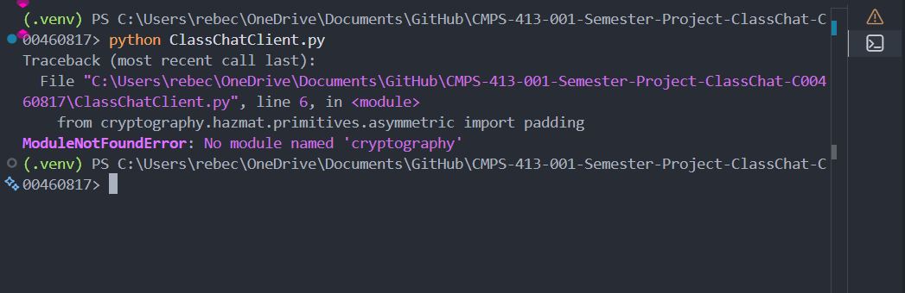
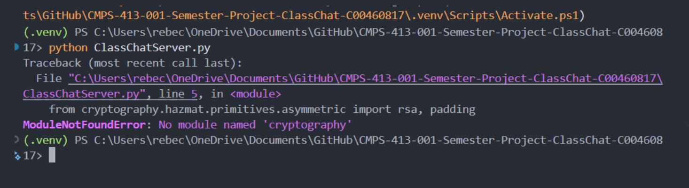

I had GitHub Copilot review these errors, and it identified that the issues were due to Import errors, Attribute errors, Syntax errors, and Formatting Errors regarding the implementation of `cryptography` to implement the Encryption Bonus Feature.  These errors were mostly in part due to the fact that I was working on my other computer, which did not have the `cryptography` library installed, and thus I had to install it using pip. 

After installing the library, I was able to resolve these errors and run the server and client successfully. However, while they were able to run, new and confusing errors began to occur when establishing the server-client connection and communication. The first test I ran resulted in the following results:

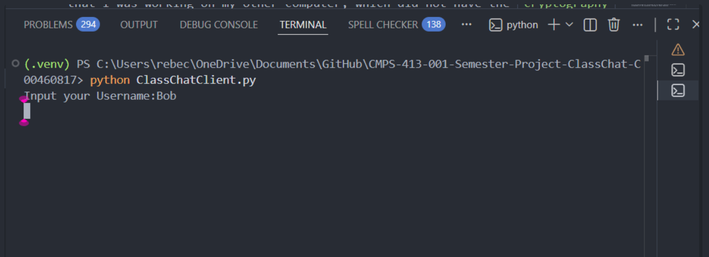
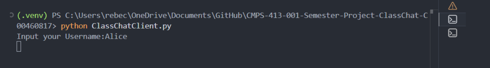
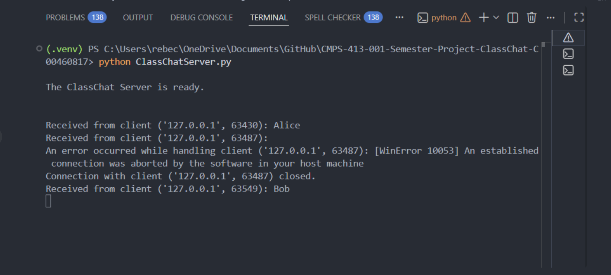

Neither Client Terminal was able to perform any further actions after entering their username, and the server terminal was shown to abort client-server connections. I asked GitHub Copilot for assistance in diagnosing the source of these errors, and it said that the server crashed due to a server-client protocol mismatch.  I asked it to explain this in more detail, and it said that the client was expecting a different Public Key from the server than what it was recieving, resulting in the client being unable to proceed to the main loop after providing a username. It explained what changes needed to be made to resolve this problem, and I used the provided examples to manually adjust my code to implement these changes. 

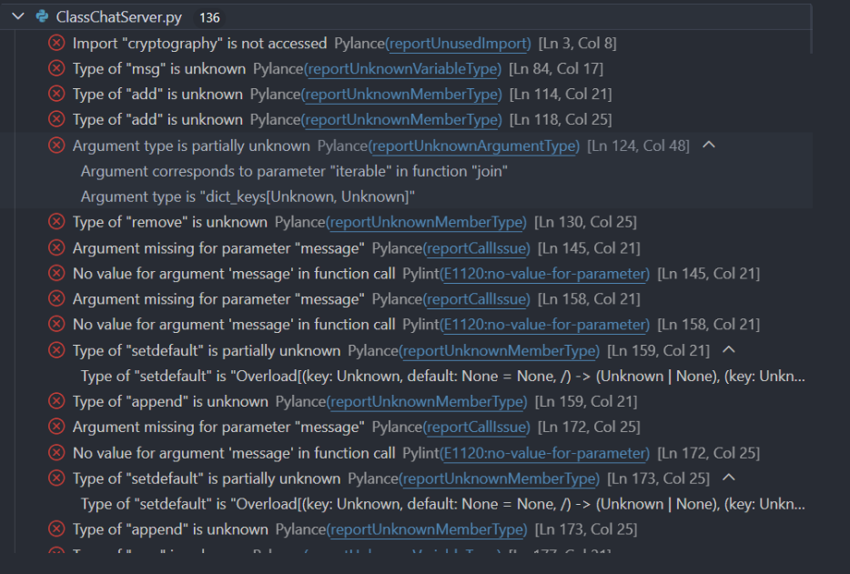
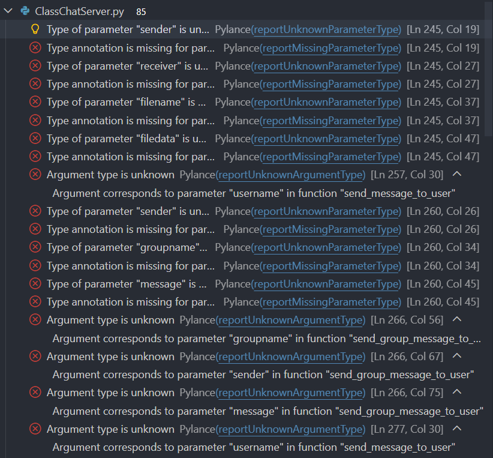

After making these adjustments, additional Pylance and Python errors were identified and I tried implementing fixes to resolve them.  Most of these had to do with function call mismatches, unclear types, missing parameters, and unused imports. I used the provided examples to guide my manual adjustments to the code to resolve these errors. I repeated this process several times, but after three iterations of this process, errors still persisted. I then allowed the editor to make changes to the specific sections that were still causing errors after my manual adjustments, and this resolved all remaining errors.

Once no more errors were identified by the editor, I ran the server and client again to test if the connection and communication were fully repaired and would work properly. I was finally able to successfully test the added Bonus Features, and all that I tested were successful! The following results occured:

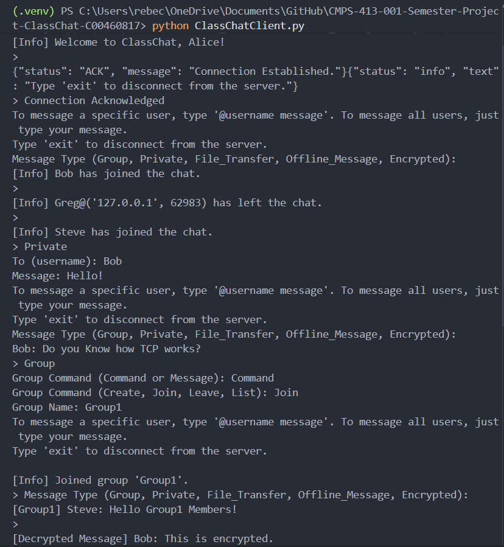
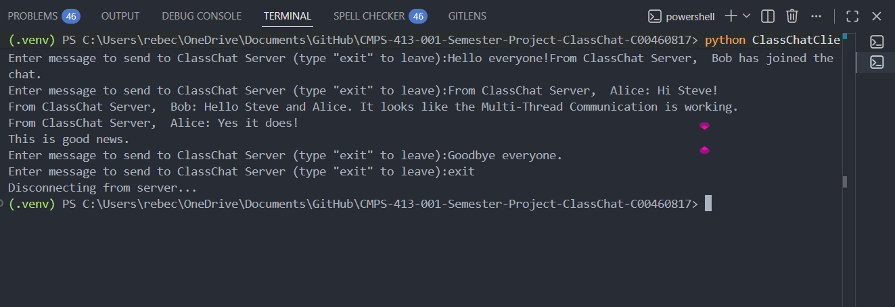

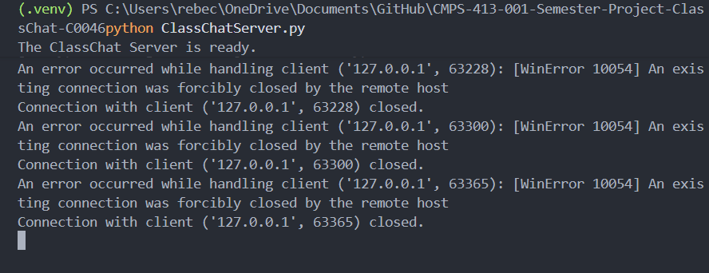

---

# 7 GUI Implementation for Easy Access and Use of ClassChat

Seeing as how the instructions for this project mentioned that, while not required, a GUI Window would be highly encouraged for us to add.  Thus, I asked Copilot what the best method was to do this, and it recommended the `tkinter` library.  It said this would be easiest to add to the existing Python Codebase, and safest out of its three recommendations to not damage or break the exsisting codebase. I worked hard to make sure that the existing Server and Client worked, and did not want to risk any more errors or problems.  

However, I was unfamiliar with `tkinter`, and thus asked for guidance andexamples of how to integrate the library with my exsisting Client. It provided me with a general overview of how to do this, and then I used the provided examples to manually adjust a new `ClassChatClient-GUI.py` file to implement these changes. I made a duplicate Client File instead of adding this feature to the existing one to avoid any conflicts. If this GUI implementation went sideways and caused more problems than improvements, then my original Command Line Client would still be intact and functional.

My first attempt at implementing the GUI was rough, and caused many errors in the code itself. I was unsure of exactly how to replace the Command Line prompts, inputs, and functions with this new and unfamiliar library. This resulted in me asking Copilot for a more extensive guide on how to integrate this library with the existing Client codebase.  From there, it game me a more exact and detailed example of how to refactor the exsising code into a GUI implementation. I used this example, as I have before, to implement adjustments within this new `ClassChatClient-GUI.py` file. First I tried to perform the refactoring to replace the Command Line prompts and inputs with the GUI elements, and then I tried to re-adapt the required and bonus features for the GUI.

After this first implementation attempt, I asked Copilot to review my code and identify any issues. It then pointed out what items I forgot to refactor (or didn't refactor correctly), redundant code, and other issues. I then proceeded to use this analysis to adjust my implementation and fix these problems manually again. After iterating and repeating this review-to-edit cycle with Copilot several times, and asked it for specific guidance on how to fix each remaining problem. Eventually I asked for a final, cleaned-up example code and used the editor to help make the final changes to match this example. 

VSCode identified 48 errors in the code, and so I had Copilot diagnose the cause.Most of these were annotation related errors, likely due to my inexperience with the library used. I iterated with asking Copilot for guidance/reviews and then implementing the suggested changes several times until all were resolved.

Once this was done I tested the server and this new GUI Client to verify that the connection and communication were working properly, and that all features were still functional with the new GUI implementation. Below are screenshots of the testing of this feature:

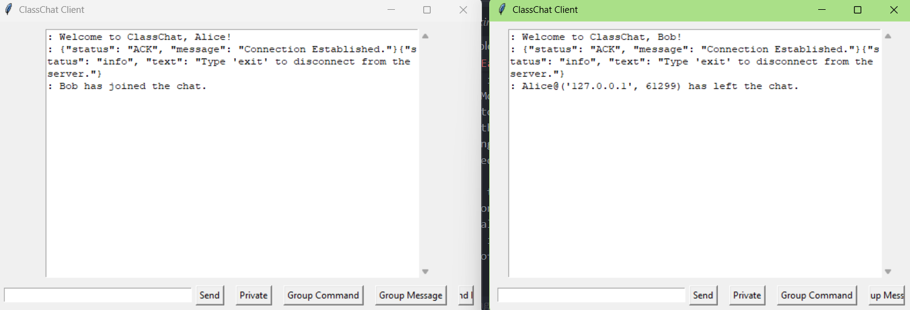

This was due to a bug that occured in the broadcasting protocol, which was fixed after a code review by Copilot. I then ran the test again, and this time it was successful! Below are screenshots of the successful testing of this feature as I tested and made fixes during tests:

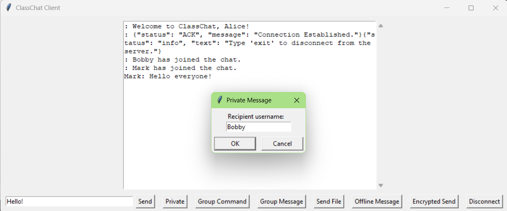
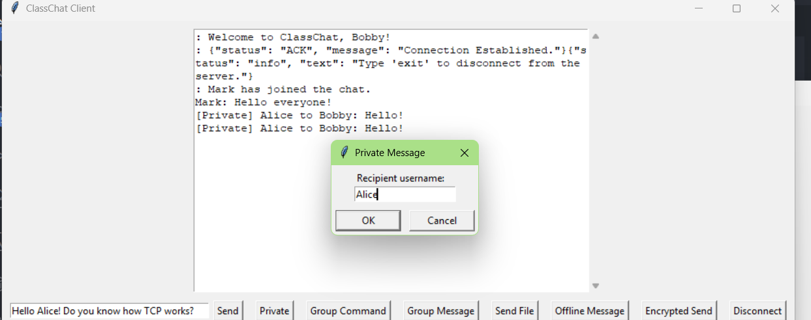

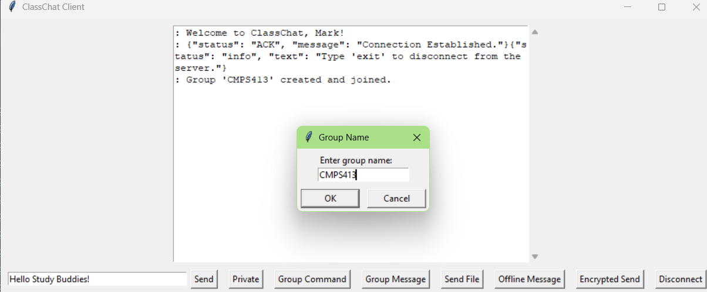
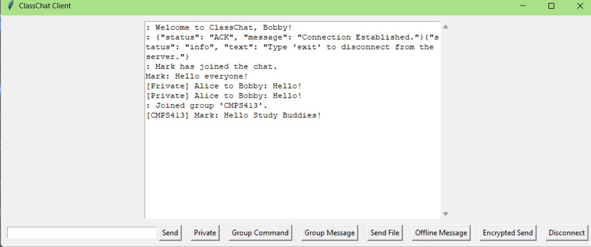

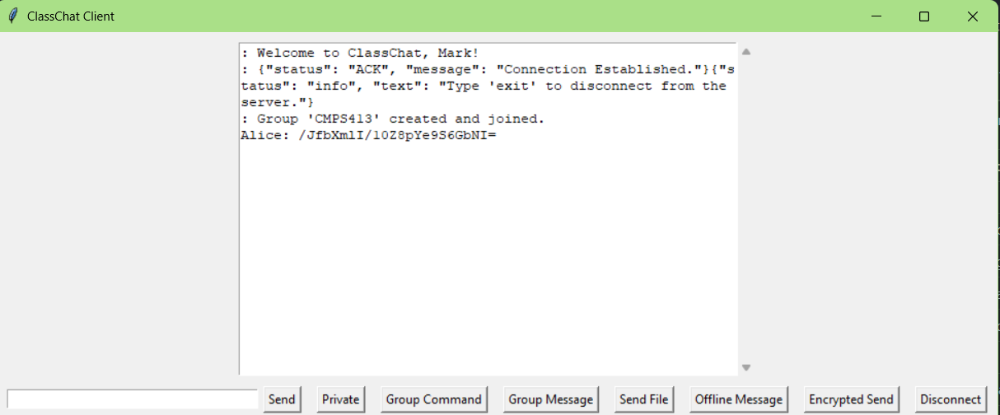

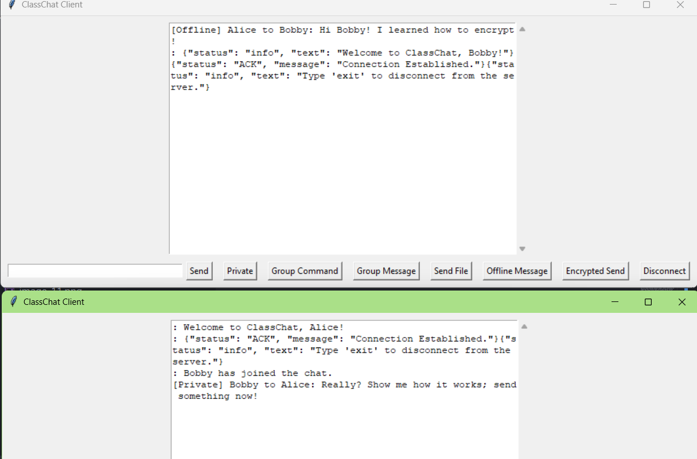
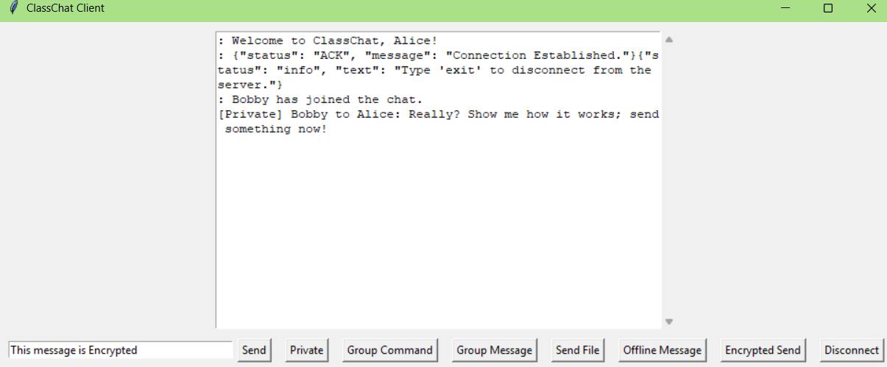
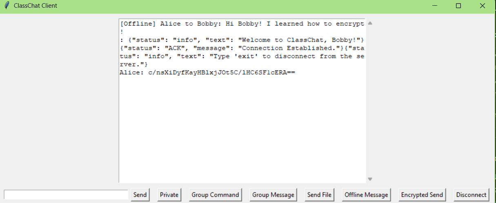

