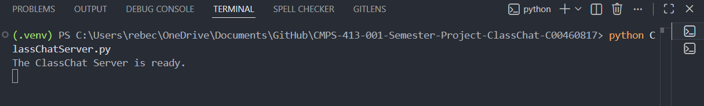
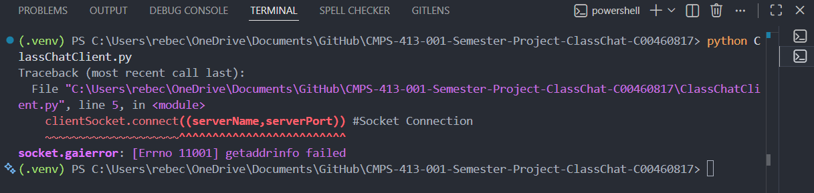

# Semester Project Technical Report
## Introduction
The objective of this project is to design and develop an online chat system, named ClassChat, 
to be used for communications and discussions among students in a class. This Technical Report provides an overview of the design and implementation of the ClassChat system, including the architecture, technologies used, and challenges faced during development.

---

## 1 Client–Server Communication using TCP/IP (30 points)

This section will describe the process of implementing the first step of this semester project: creating a client-server communication using TCP/IP. The server is intended to listen for incoming connections from clients, and clients will connect to the server to send and receive messages.

### 1.1 Server Implementation

Using the examples found in the textbook as a guide, I proceeded to create the `ClassChatClient.py` and `ClassChatServer.py` files for the server and client respectively. When inputting the code samples from the textbook chapter slides, the VSCode editor automatically identified syntax errors due to mismatched quotes, and I made the proper adjustments.  I also changed the basic server name into "ClassChatServer" to make it more specific to this project.

### 1.2 Client Implementation

When starting this step, I realized I had accidentally put the Client code into the Server file, and fixed this mistake. I then followed the same process for the client implementation, using the example in the textbook slides as a guide, and referring to it when writing the file contents.  Once both the Server and Client files were created, VSCode identified syntax errors in the code, specifically a Wildcard import error due to the `from socket import *` line from the textbook slide example at the top of both files. 

The VSCode error flag provided the following link, which broke down the error and how to resolve it:
https://github.com/microsoft/pylance-release/blob/main/docs/diagnostics/reportWildcardImportFromLibrary.md

I used this guidance to change the import statement to `from socket import socket, AF_INET, SOCK_STREAM`, based on the `(server/client)Socket = socket(AF_INET,SOCK_STREAM)` calls later on in these files. This change resolved the syntax error and allowed me to proceed with the implementation of the client-server communication.

### 1.3 Requirements  

The Client-Server pair are now created, with no remaining errors recognized by the VSCode editor. I adjusted the names of some variables to specifically fit the project, and not the template/example that I based the code on.Before proceeding into the next step of this project and implementing the Advanced Client requirements, I ran the server and client files to verify that their basic TCP/IP communication worked. 

The Server launched and listened for clients as designed, but an error occurred when the Client attempted to connect.  I was unsure of the cause for this error, and asked Github Copilot for assistance in diagnosing the source of the issue. It stated that the reason for this problem was due to the `servername` variable not being a valid hostname or address, recommending I change it to `localhost`.  In hindsight, this was a very simple mistake that I should have caught myself, but I had been so focused on following the textbook example and getting the code to run that I overlooked this detail.

I did this and tried running the server and client again, and this time it worked. I was able to enter a username and receive a response from the server, confirming that the TCP/IP communication was successfully established between the client and server.

I thus added an entry to the `TRANSCRIPT.md` file to document the exact usage of Github Copilot to help identify this issue and find its resolution for full transparency.

---

## 2 Advanced Client (20 points)

Now that the simple client-server communication system has been created and verified, it was time to move onto the next step of Advancing Client capabilities so that a client can both send and receive message at the 
same time with less CPU workload. I/O multiplexing was the suggested method of executing this task within the instructions, specifically to use system callback function to activate a client’s application if the socket receives data from the server or keyboard input from the user. 

Thus, I went back to the textbook chapter slides to review Multiplexing and how it worked. These slides defined Multiplexing as a method to handle data from multiple sockets, and Demultiplexing as using header info to deliver these received segments to correct socket.

The instructions also provided a list of the proper calls for multiplexing:  `select()`, `poll()` and `epoll()` in the Client. The textbook slides did not provide any examples of how to implement these calls, so I turned to Github Copilot for assistance in understanding what these functions were, how they were typically used, and which would be best depending on the desired scalability. 

I decided to use the recommended `select()` function, as it provided maximum portability and simplicity. I then added `import select` to the top of the `ClassChatClient.py` file, and proceeded to begin writing the `select()` function call into the Client based on a provided example.  As I was doing so, the VSCode editor identified syntax errors in the code, and automatically auto-filled the command to resolve it.

To make sure I was using the `select()` function correctly, I again turned to Github Copilot for assistance in verifying that I properly implemented this function within the context of the Client-Server communication. Copilot then identified two major issues with my code:

1. The code only used `select()` to wait for the server response after sending the username and not monitor continuously monitor both the socket (for incoming server messages) and standard input (for user input) in a loop.

2. The client was not able to send messages (from user input) and receive messages (from the server) at any time, without blocking.

From here it gave an example on how to properly implement the `select()` function for Windows, which I then used as a guide to adjust my implementation and fix these problems. From there I asked it one last time to be sure I had implemented the `select()` function correctly, and it confirmed that I had done so properly, with a minor adjustment suggestion on how to avoid double prompting.

From here, I ran the server and client to verify that the Client-Server communication would still work with these new changes, and that this Multiplexing method was working correctly as well. The below errors occured:

I then asked Github Copilot for assistance in diagnosing the source of these errors, and it identified that the issue was due to the fact that the `select()` function on Windows does not support monitoring standard input (keyboard input) directly. It recommended using a workaround by creating a separate thread to read user input and send it to the server, while the main thread continues to use `select()` to monitor the socket for incoming messages from the server. I used the provided example to implement this workaround. Once this change was made I reran the server and client to test:

The server and client now worked when launched, though after the first message was sent from the client to the server, the client would not receive any responses from the server. I again turned to Github Copilot for assistance in diagnosing this issue. This was fixed using Copilot's suggestion to improve the server loop by adding a check for empty messages. This resolved the issue and allowed the client to properly receive messages from the server after sending a message.

I updated the `TRANSCRIPT.md` file to document the exact usage of Github Copilot to help identify these issues and find their resolutions for full transparency.

---

## 3 Multi-Thread Communication Server 

Once the Advanced Client abilities were implemented and testing it was successful, I moved on to the next step of the project: creating a Multi-Thread Communication Server. The goal of this step was to further develop the server to handle multiple clients simultaneously to handle multiple concurrent problems. This way, ClassChat could allow multiple students to discuss class topics or homework problems at the same time. Seeing as the last step of this project revealed I could not use I/O Multiplexing, and I had to implement threading to work around this issue, this felt like the natural choice for the next step.

I asked Copilot for a general idea of how to impement a multi-threaded server, and it produced a Five Phase Plan outlining the major steps to implement this feature. My goal was to follow this plan manually, and get as close to perfect as possible using what I've learned so far, and then have Copilot review my implementation to ensure I had done so correctly.

Firstly, I created a shared `clients = []` list to track active clients and their threads, applying a `threading.Lock()` to ensure thread safety. I then tried implementing the client handling to create a new thread for each oncoming client connection.  After this, I did my best to have the threads listen for their respective clients. Then I added the broadcasting funciton with the help of VSCode's auto-fill.  Finally I tried to have the disconnected clients removed from the active clients list, and their threads properly closed.

After my first manual implementation attempt, I asked Copilot to review my code and identify any issues. It identified several problems with my implementation, including: what tasks were incomplete, what tasks were incorrect, and what tasks were missing. I then proceeded to use this analysis to adjust my implementation and fix these problems.